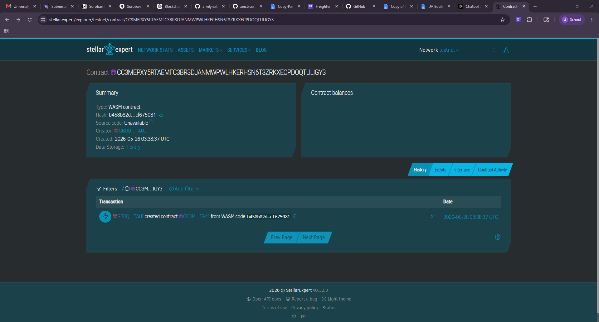

# 📘 VeriBadge

## Project Name and One-Line Description

**VeriBadge** — A Stellar-based NFT achievement verification system that transforms certificates and accomplishments into tamper-proof, blockchain-verified digital badges.

---

## Problem and Solution

### Problem

In many schools and training centers in the Philippines and across Southeast Asia, students and professionals receive paper or PDF certificates that are easily lost, forged, or delayed in verification. This creates distrust in credentials and slows down hiring or promotion processes.

### Solution

VeriBadge issues achievements as NFT-like digital badges on the Stellar blockchain using Soroban smart contracts. Institutions can mint verifiable credentials that are permanently stored, instantly verifiable, and owned by the recipient.

---

## Timeline

- **Week 1:** Smart contract design and setup (Soroban environment, data structures)
- **Week 2:** NFT badge minting logic + verification functions
- **Week 3:** Frontend dashboard + wallet integration prototype
- **Week 4:** QR verification system + testing on testnet + demo preparation

---

## Stellar Features Used

- Soroban Smart Contracts – Core logic for minting and verifying badges  
- Custom Assets / NFT-like tokens – Represent achievements as digital badges  
- Trustlines – Allow users to accept badge assets securely  
- XLM / USDC (optional) – Incentives or reward-based achievements  
- Stellar Network – Fast, low-cost transactions for scalable issuance  

---

## Vision and Purpose

VeriBadge aims to replace traditional paper-based certificates with permanent, verifiable digital achievements that cannot be forged or altered. The system builds a global standard for academic, professional, and organizational recognition using blockchain technology, making verification instant, transparent, and universally accessible.

---

## Prerequisites

Before running the project, ensure you have:

- Rust (latest stable version)  
- Soroban CLI (compatible with Stellar Soroban SDK)  
- Node.js (for optional frontend integration)  
- Cargo (Rust package manager)

---

## How to Build

```bash
soroban contract build
```

This compiles the smart contract into a WebAssembly (WASM) file ready for deployment.

---

## How to Test

```bash
cargo test
```

Runs all unit tests to verify:

- NFT minting logic  
- Badge verification  
- Storage integrity  

---

## How to Deploy to Testnet

```bash
soroban contract deploy \
  --wasm target/wasm32-unknown-unknown/release/veribadge.wasm \
  --network testnet
```

This deploys the VeriBadge smart contract to the Stellar Testnet for live testing.

---

## Sample CLI Invocation (MVP Function)

### Mint Achievement Badge

```bash
veribadge mint_badge \
  --issuer GISSUER123456789 \
  --recipient GRECIPIENT987654321 \
  --title "DEAN_LIST" \
  --timestamp 1716710000
```

### Verify Badge Ownership

```bash
veribadge verify_badge \
  --badge_id 1 \
  --user GRECIPIENT987654321
```

### Expected Output

```
true
```

---

## License
Contract ID: CC3MEPXY5RTAEMFC3BR3DJANMWPWLHKERHSN6T3ZRKXECPDOQTULIGY3
MIT License

## Stellar Expert Link
https://stellar.expert/explorer/testnet/contract/CC3MEPXY5RTAEMFC3BR3DJANMWPWLHKERHSN6T3ZRKXECPDOQTULIGY3

## VeriBadge Photo
